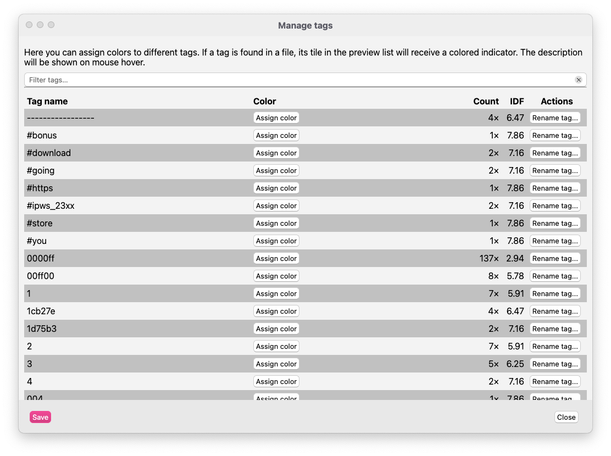

# Tag Manager

Zettlr features a comprehensive tagging system to add keywords to your files for a horizontal, non-hierarchical file sorting system. However, as the amount of files in your setup increases, it can become difficult to maintain overview over the tags. In addition, you may want to use some tags in a more functional way, such as `#todo` or `#needs-review`.

This is why Zettlr contains a powerful tag manager that allows you to manage the tags in your setup. You can open the tag manager by going to "Zettlr" &rarr; "Manage tags…" (macOS) or "File" &rarr; "Preferences" &rarr; "Manage tags…" (Windows/Linux).

The tag manager lists all the tags that the app has found across your files alongside a count and an [Inverse Document Frequency (IDF)](https://en.wikipedia.org/wiki/Tf%E2%80%93idf#Inverse_document_frequency) score. The IDF score is reversely proportional to the amount of files a tag occurs in and offers an informational score as to how important a tag is. The lower the number, the less important the keyword likely is for differentiating files from each other. Usually, functional tags will have a very small IDF score, while rarely used tags will have a high score.

## Sorting and Filtering Tags

You have various options of viewing your tags. First, you can filter the tags with the input field on top of the list. This can help you find tags you need more quickly.

Then, you can sort the table based on columns. For example, by clicking on the "IDF" column label, Zettlr will toggle between listing files with the scores ascending and descending. Likewise with the "Count", "name", and "Color" columns.

## Assigning Colors to Tags

In the middle of the tag manager, you will find a "color" column. You can use this to denote "special" tags that will give files that contain this tag a special color in appropriate places such as the file list.

For example, you might want to include a "todo" tag or a "needs review" tag. In order to do this, follow these steps:

1. Assign the tag to at least one file so that it shows up in the tag manager.
2. Then open the tag manager and search for the tag you want to assign a color to.
3. Click "Assign color" to be able to choose a color.
4. Optionally, write a short description into the corresponding field that will be shown when you move your mouse over a color indicator in, e.g., the file list

To remove the color association from a tag, simply click "Remove color".

When you are finished, click "Save" to close the tag manager and apply the changes.

## Renaming Tags

Lastly, the tag manager allows you to rename tags in bulk. For example, if you have used a given tag frequently, but decided it should be named differently, you can click "Rename tag". Insert the new tag in the text field and confirm by clicking on "Rename".

Then, Zettlr will first determine how many files will be affected and give you a final confirmation window that asks you if you really want to replace the provided tag across all of the affected files. Click "Cancel" to abort the process.

After clicking on "Yes", Zettlr will immediately begin replacing the tags in all affected files.
